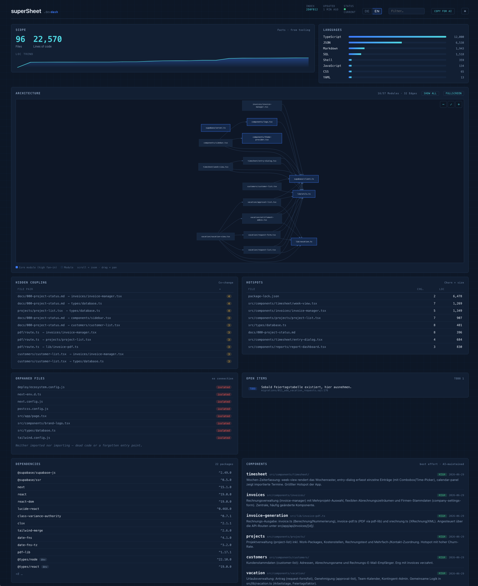

# devdash

A lightweight, drop-in developer dashboard for AI-assisted projects.

After a few days of fast, AI-heavy coding it's easy to lose the thread: *what*
got built and *how* the pieces connect. devdash answers that in one glance — a
single self-contained HTML page that maps your codebase, surfaces hidden
coupling, and keeps an honest, AI-maintained component log alongside the hard
facts.

No build step, no service, no database. Pure-Python collector (standard library
only) plus one HTML file. Drop the `.devdash/` folder into any repo and go.



---

## The idea: two layers, never mixed

devdash draws a hard line between what a machine knows for certain and what an AI
*thinks* it knows.

- **Facts** — file inventory, lines of code, the import graph, git churn,
  co-change, TODOs, dependencies. Produced deterministically by `collect.py`.
  The AI never counts or invents these.
- **Semantics** — component descriptions and architectural decisions. Maintained
  by your AI agent, and shown in the dashboard with explicit *confidence* and
  *freshness* markers so you always know how much to trust them.

A dashboard that lies is worse than none. This split is the whole point.

---

## Install

Drop the folder into the root of any git repository:

```bash
cp -r devdash/.devdash /path/to/your-project/.devdash
```

Generate the data (run from the project root — Python 3.8+, no dependencies):

```bash
python .devdash/collect.py
```

View the dashboard. Serve it locally so it can read the JSON files:

```bash
cd .devdash && python -m http.server 8000
# then open http://localhost:8000/
```

Or just open `.devdash/index.html` directly — the collector also writes a
`devdash-data.js` bundle so the page works over `file://` with no server.

### Keep it fresh automatically

A one-line post-commit hook re-runs the collector after every commit:

```bash
echo 'python .devdash/collect.py' > .git/hooks/post-commit
chmod +x .git/hooks/post-commit
```

---

## What the dashboard shows

| Panel | Source | What it tells you |
|-------|--------|-------------------|
| **Scope** | facts | Files, lines of code, share of AI commits, LOC trend over time |
| **Languages** | facts | LOC by language |
| **Architecture** | facts | Import graph as a diagram; core modules highlighted. Pan, zoom, fullscreen; compact/all toggle. Click any node for its detail panel |
| **Hidden coupling** | facts | Files that change together in git but aren't directly linked — the coupling the import graph misses |
| **Hotspots** | facts | Churn × size: where the risk concentrates |
| **Orphaned files** | facts | Neither imported nor importing — dead code or forgotten entry points |
| **Open items** | facts | TODO / FIXME / HACK / XXX / BUG markers across the code |
| **Dependencies** | facts | Parsed from package.json, requirements.txt, pyproject.toml, Cargo.toml, go.mod |
| **Components** | semantics | AI-maintained module descriptions, with confidence + last-updated. Click one for a detail panel (uses / used-by derived from the graph). Flagged when the code is newer than the description |
| **Decisions** | semantics | Append-only architectural decision log |
| **Tests** | facts | Which components have test files present (presence, not coverage %) |
| **Since last run** | facts | Files added/removed and LOC delta versus the previous collector run |
| **Roadmap** | semantics | Optional `roadmap.md`, rendered as-is |

The page is bilingual (English / German) with a switch in the header; the choice
is remembered. It defaults to your browser language.

The header also has a **dark / light** toggle, a **filter** box that narrows the
table panels, and a **Copy for AI** button that puts a compact text map of the
project (components, structure, open items, roadmap, decisions) on your clipboard
— paste it straight into a prompt instead of dumping the whole repo.

---

## For AI agents

The **Facts** layer needs nothing from your agent — `collect.py` produces it. The
**Semantics** layer (`components.json` + `decisions.md`) is only as good as the
instructions your agent gets, and those instructions live in `.devdash/RULES.md`.

For your agent to maintain that layer, it has to actually read `RULES.md`. Wire
it in once, in whatever your tool uses for standing instructions:

- **Claude Code** — add a line to `CLAUDE.md` at the repo root:
  `> When you change the codebase, follow .devdash/RULES.md to keep components.json and decisions.md current.`
- **Cursor** — same line in `.cursorrules` (or a file under `.cursor/rules/`).
- **GitHub Copilot** — same line in `.github/copilot-instructions.md`.
- **Any other agent / custom system prompt** — paste the line into its system
  prompt, or just point it at the file: *"Read `.devdash/RULES.md` and follow
  it."*

`RULES.md` is the contract: the agent may write **only** `components.json`,
`decisions.md`, and the optional `roadmap.md`, never the generated facts, and
must flag uncertainty honestly with `confidence` markers. Wire it in once and the semantic layer maintains
itself as the project evolves. The instruction footprint is deliberately small
(a few hundred tokens), so it costs almost nothing to keep in context.

> If you skip this step, the dashboard still works — you just get the Facts
> panels, and the Components / Decisions panels stay empty until something fills
> them.

---

## Deliberately out of scope

devdash stays lightweight on purpose. It does **not** do:

- health scores or quality grades (subjective, easy to game)
- embeddings / semantic search (heavy, needs a vector store)
- a precise AST graph (the coarse import scanner covers ~every language at a
  fraction of the cost)
- an MCP server or background daemon

The import scanner is pattern-based, so it can miss aliased imports (e.g.
TypeScript `@/` path mappings). When that happens, the **Hidden coupling** panel
is the more reliable signal — it's derived from git history, not import parsing.

---

## Requirements

- Python 3.8+ (standard library only) for the collector
- A modern browser for the dashboard
- [Mermaid](https://mermaid.js.org/) is loaded from a CDN for the architecture
  diagram, with a plain-text fallback when offline

---

## Layout

```
.devdash/
├── collect.py        # the collector — deterministic facts, zero LLM
├── index.html        # the dashboard — self-contained, bilingual
├── RULES.md          # the contract for AI agents
├── components.json   # semantic layer: component descriptions (agent-maintained)
├── decisions.md      # semantic layer: decision log (agent-maintained)
├── roadmap.md        # semantic layer: optional roadmap (agent-maintained)
└── .gitignore        # ignores the generated metrics.json / graph.json / devdash-data.js
```
